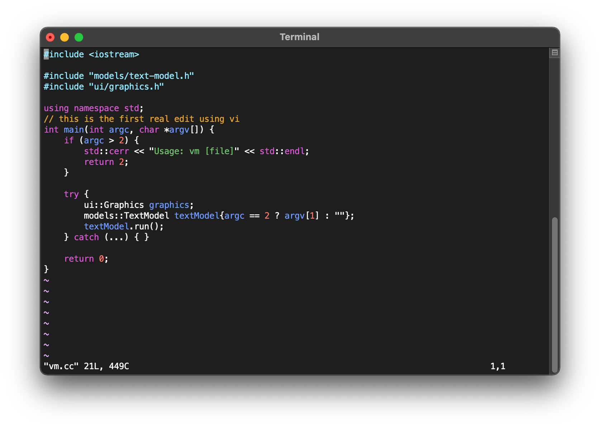

# vm
A Lightweight Vim-like Text Editor. Supports all the popular vim and vi commands, adding better C/C++ syntax highlighting. Supported commands:
```
a b cc c[any motion] dd d[any motion] f h i j k l n o p r s u w x yy y[any motion]
A F I J N O P R S X ^ $ 0 . ; / ?
^b ^d ^f ^g ^u
:w :q :wq :q! :r :0 :$ :line-number
```
vm also has an unlimited undo history, as well as many quality of life emprovements over vim.

Demo vm with vm C++ sourcecode:

